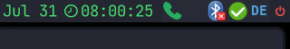
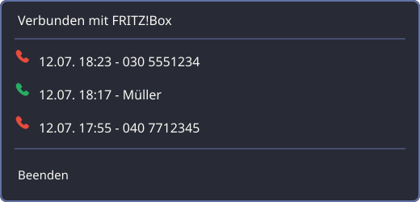

# FritzMonitor

[](LICENSE)


FritzMonitor ist ein nativer Linux-Systemtray-Monitor für den
FRITZ!Box-Callmonitor. Er verbindet sich über TCP mit Port `1012`, meldet
eingehende Anrufe per Desktop-Benachrichtigung und zeigt den Anrufstatus im
Tray.

Die aktuelle Projektversion steht in `VERSION` und wird von CMake für Binary und
Pakete übernommen. FritzMonitor wurde erstellt und gestaltet von Thomas Tuul
zusammen mit OpenAI Codex.



Das telefonförmige Icon ist grün, solange keine ungelesenen eingehenden Anrufe
vorliegen. Nach einem eingehenden Anruf wird es rot; das Öffnen des Menüs
markiert die Anrufe als gelesen.

## Pulldown-Menü

Das Menü enthält pro Anruf genau eine Zeile. Sie zeigt in dieser Reihenfolge
einen grünen Telefonhörer für angenommene beziehungsweise einen roten
Telefonhörer für verpasste Anrufe, Datum und Uhrzeit im Format `12.07. 18:23`
und anschließend den Namen oder – falls keine Namensauflösung möglich ist – die
Rufnummer. Es bleiben die letzten drei Anrufe erhalten, der neueste steht oben.



Die Menü- und Statussprache folgt der Systemlokalisierung: Deutsch bei einer
deutschen Locale, sonst Englisch.

## Verwendung

Der FRITZ!Box-Callmonitor muss aktiviert sein. Dazu auf einem angeschlossenen
Telefon `#96*5*` wählen. FritzMonitor verbindet sich anschließend automatisch
mit `fritz.box:1012` beziehungsweise dem in der Konfiguration angegebenen Host
und verbindet sich nach Netzwerkunterbrechungen erneut.

Die Konfiguration liegt standardmäßig unter:

```text
~/.config/fritzmonitor/config.toml
```

```toml
host = "fritz.box"
port = 1012
reconnect_seconds = 5
max_events = 20
notify_incoming = true
notify_missed = true
# Optional: Telefonbuchabfrage über TR-064
addressbook_enabled = true
tr064_port = 49000
tr064_username = "fritzmonitor"
```

Das TR-064-Passwort wird standardmäßig geschützt im Secret Service des Desktops
gespeichert und kann beispielsweise mit Seahorse verwaltet werden. Bei einer
noch vorhandenen Klartext-Konfiguration übernimmt der folgende Befehl das
Passwort in den Keyring, prüft den gespeicherten Wert und entfernt erst danach
die Zeile `tr064_password` atomar aus der TOML-Datei:

```sh
fritzmonitor --migrate-tr064-password
```

Ein neues oder geändertes Passwort wird ohne sichtbare Terminaleingabe mit
`fritzmonitor --store-tr064-password` gespeichert. Der Eintrag erscheint in
Seahorse als `FritzMonitor TR-064 (fritz.box)`. Weitere Einzelheiten und die
Fallback-Reihenfolge stehen in [FRITZMONITOR.md](FRITZMONITOR.md).

## Installation und Pakete

Eine kurze, kopierfertige Anleitung für Debian-Paket, FRITZ!Box-Konfiguration,
Seahorse und den systemd-User-Service steht in [QUICK-SETUP.md](QUICK-SETUP.md).

Die Paketversion folgt [SemVer](https://semver.org/): `MAJOR.MINOR.PATCH` für
API-/Funktionsänderungen und Fehlerkorrekturen. Debian- und RPM-Pakete tragen
zusätzlich ein distributionsspezifisches Paket-Release, derzeit `1`.

Nach einer CMake-Konfiguration mit den Paketpfaden können die Pakete manuell
gebaut werden:

```sh
cmake -S . -B build/packages -DCMAKE_BUILD_TYPE=Release \
  -DCMAKE_INSTALL_PREFIX=/usr \
  -DFRITZMONITOR_SERVICE_EXECUTABLE=/usr/bin/fritzmonitor
cmake --build build/packages --target package-deb
cmake --build build/packages --target package-rpm
```

Die erzeugten Dateien liegen unter `build/packages/`. Für reproduzierbare Builds
ohne Entwicklungssoftware auf dem Host stehen Container-Wrapper bereit:

```sh
./scripts/package-in-container.sh deb
./scripts/package-in-container.sh rpm
```

Die Wrapper schreiben nach `build/package-deb/` beziehungsweise
`build/package-rpm/`. Die Pakete können anschließend mit den üblichen
Systemwerkzeugen installiert werden:

```sh
sudo apt install "./build/package-deb/fritzmonitor-$(cat VERSION)-Linux.deb"
```

Auf Fedora:

```sh
sudo dnf install "./build/package-rpm/fritzmonitor-$(cat VERSION)-Linux.rpm"
```

Nach der Installation wird der User-Service mit systemd aktiviert:

```sh
systemctl --user daemon-reload
systemctl --user enable --now fritzmonitor.service
```

Die installierte Version lässt sich prüfen:

```sh
fritzmonitor --version
```

Der produktive Native-Build ohne Paketierung bleibt:

```sh
./scripts/container-build.sh
```

Die geprüften Artefakte liegen danach unter `build/container-release/`. Eine
vollständige technische Beschreibung steht in
[FRITZMONITOR.md](FRITZMONITOR.md).

GitHub Actions baut Debian- und Fedora-Pakete bei manueller Auslösung sowie bei
Pushes auf `master` und legt sie als Workflow-Artefakte ab. Für einen
veröffentlichten Release wird ein zur Datei `VERSION` passender Tag gepusht.
Dann hängt der Workflow die Pakete automatisch an einen gleichnamigen
GitHub-Release an:

```sh
version=$(cat VERSION)
git tag -a "v$version" -m "FritzMonitor $version"
git push origin "v$version"
```

Die Attribution steht in [COPYRIGHT.md](COPYRIGHT.md). FritzMonitor steht unter
der [GNU General Public License Version 3](LICENSE).

## Entwicklung

Der Build verwendet C++20 und CMake. Entwicklungsabhängigkeiten werden nur im
Builder-Container installiert; auf dem Produktivsystem werden ausschließlich
Runtime-Bibliotheken benötigt. Der Container-Build führt auch die Tests aus. Für
den geschützten Credential-Speicher wird auf dem Host zusätzlich die
libsecret-Runtime benötigt; die Pakete deklarieren diese Abhängigkeit.

### Markdown mit Prettier und markdownlint prüfen

Die Markdown-Werkzeuge laufen ausschließlich in einem eigenen Container. Auf dem
Host werden nur Docker und eine funktionierende Docker-Engine benötigt; Node.js,
npm, Prettier und markdownlint werden nicht installiert. Der Container verwendet
die in `tools/markdown/package-lock.json` festgeschriebenen Abhängigkeiten und
wird vom Wrapper bei Bedarf neu gebaut.

Alle Projekt-Markdown-Dateien read-only auf korrekte Prettier-Formatierung und
markdownlint-Regeln prüfen:

```sh
./scripts/markdown-in-container.sh check
```

Prettier auf `README.md`, `FRITZMONITOR.md`, `QUICK-SETUP.md`, `COPYRIGHT.md`
und `AGENTS.md` anwenden und anschließend markdownlint ausführen:

```sh
./scripts/markdown-in-container.sh format
```

Die Regeln stehen in `.prettierrc.json` und `.markdownlint-cli2.yaml`. Das
Repository wird im Prüfmodus read-only und im Formatiermodus mit der UID und GID
des aktuellen Benutzers eingebunden, damit keine root-eigenen Dateien entstehen.
Der gleiche Prüfpfad läuft auch in GitHub Actions.
